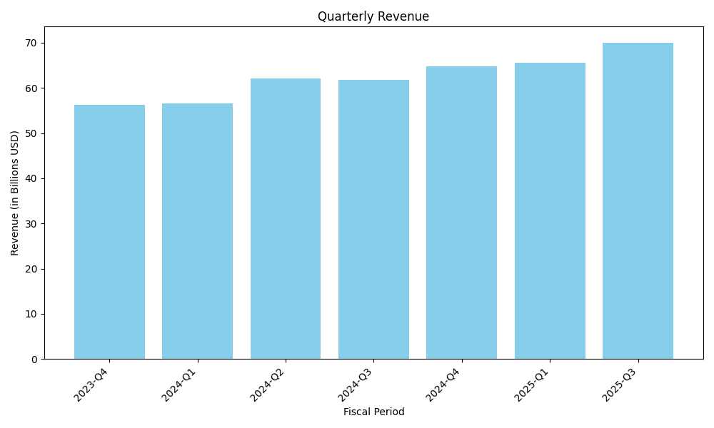

# Financial Research Report: Microsoft's competitive position against Google and Amazon in the AI space

## Executive Summary

Microsoft is strategically positioned in the AI space through significant investments and partnerships, notably with OpenAI. However, it faces strong competition from Google, which benefits from vertical integration and proprietary data advantages. Microsoft's financial performance remains robust, with substantial revenues and net income, indicating a strong foundation to support its AI initiatives.

## SWOT Analysis

### Strengths
- Microsoft's investment in OpenAI, amounting to over $10 billion, positions it as a key player in generative AI (source: https://finance.yahoo.com/news/microsoft-singles-googles-competitive-edge-174128008.html).
- Microsoft's diverse business model and hybrid-technology strategy provide a competitive edge over Amazon and Google in the cloud space (source: https://www.forbes.com/sites/bobevans1/2018/09/17/how-1-microsoft-is-beating-amazon-google-and-everyone-else-in-the-cloud-the-strategic-breakdown/).

### Weaknesses
- Microsoft lacks the vertical integration that Google possesses, which includes AI-optimized chips and a vast array of proprietary data (source: https://finance.yahoo.com/news/microsoft-singles-googles-competitive-edge-174128008.html).

### Opportunities
- Encouraging pro-competitive partnerships in the AI space can help Microsoft counteract the advantages of vertically integrated competitors like Google (source: https://finance.yahoo.com/news/microsoft-singles-googles-competitive-edge-174128008.html).

### Threats
- Google's access to proprietary data from platforms like YouTube and its AI semiconductors provide it with a significant competitive advantage (source: https://finance.yahoo.com/news/microsoft-singles-googles-competitive-edge-174128008.html).
- The hype surrounding AI may not be sufficient to sustain investor interest, posing a risk to companies heavily invested in AI, including Microsoft (source: https://finance.yahoo.com/news/microsoft-singles-googles-competitive-edge-174128008.html).

## Market Outlook

The AI market is highly competitive, with Google leveraging its vertical integration and proprietary data to maintain a strong position. Microsoft's strategy of investing in partnerships, such as with OpenAI, and its robust financial performance, with revenues of $270 billion and net income of $96.6 billion, provide a solid foundation for growth. However, the company must navigate regulatory scrutiny and the challenge of sustaining investor interest in AI (source: https://finance.yahoo.com/news/microsoft-singles-googles-competitive-edge-174128008.html).

## Visualizations

